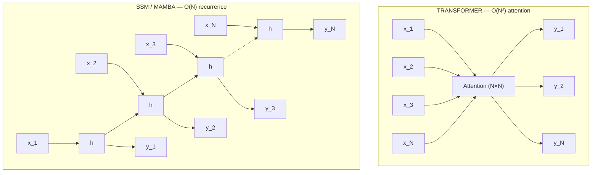
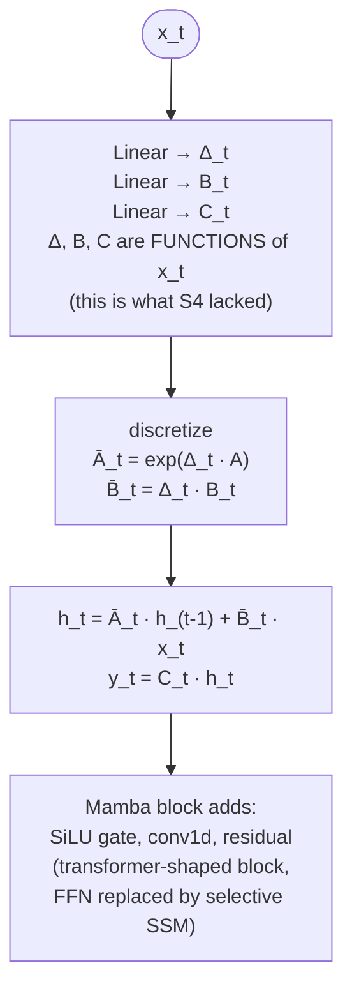
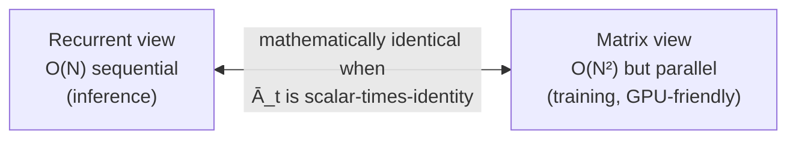

## Why This Exists

**Problem**: Transformers have O(N²) attention cost — processing a 100K-token document requires attending every token to every other token, making long-context inference prohibitively expensive. Linear attention approximations sacrifice quality.

**Key insight**: Reformulate sequence modeling as a state space model (continuous ODE discretized to a recurrence) with input-dependent gating — this gives O(N) linear-time processing with constant memory per token during inference, while a parallel scan enables efficient training like a CNN.

**Reach for this when**: You have very long sequences (>8K tokens) where Transformer attention becomes a bottleneck, need O(1) per-token inference (streaming, real-time), or want linear scaling with sequence length. For short-medium sequences (<4K), Transformers with Flash Attention are still competitive or better.


# Mamba & State Space Models (SSMs)

## Architecture Diagram — Recurrence vs Attention, and the "Selective" Trick

**Transformer (O(N²) attention) vs SSM / Mamba (O(N) recurrence):**



| | Transformer | SSM / Mamba |
|---|---|---|
| Memory | O(N²) | O(1) per step (just h) |
| Train | parallel | parallel scan → O(N) total |
| Inference | O(N) per token (KV-cache) | streaming, O(1) per token |

**Inside one Mamba-1 (S6) block — the "selective" trick:**



**Mamba-2 (SSD) duality — same operation viewed two ways:**



**Why "selective"**: in S4, A, B, C are *static* — the model can't pick "which token to remember vs forget" based on content. Mamba's S6 makes Δ, B, C depend on x_t, giving it the same content-based gating that attention has, but with O(N) cost.

**Why hybrid (Jamba, Zamba)**: pure SSM struggles on tasks needing exact retrieval ("what's at position 47?"). Mixing a few attention layers among many SSM layers buys back retrieval without paying full O(N²).

## Core Concept: State Space Models

SSMs map input sequence `x(t)` → output `y(t)` through a latent state `h(t)`:

```
h'(t) = A·h(t) + B·x(t)    # state evolution
y(t)  = C·h(t) + D·x(t)    # output projection
```

**Matrices:**
- **A** (N×N): state transition — controls how hidden state evolves over time
- **B** (N×1): input projection — how input enters the state
- **C** (1×N): output projection — how state maps to output
- **D** (1×1): skip connection (feedthrough, often omitted)

### Discretization

Continuous SSM → discrete for sequence processing. Zero-Order Hold (ZOH):

```python
# Given step size Δ (learnable per-channel):
A_bar = exp(Δ * A)           # matrix exponential
B_bar = (A)^{-1} (A_bar - I) * B
# Then recurrence: h[k] = A_bar·h[k-1] + B_bar·x[k]
```

Discretization bridges continuous dynamics (ODEs) with discrete token sequences.

### Dual Computation Modes

1. **Recurrent** (inference): O(1) memory per step, process token-by-token
2. **Convolutional** (training): materialize kernel `K = (C·B, C·A·B, C·A²·B, ...)`, apply via FFT — O(N log N)

---

## S4: Structured State Spaces for Sequences

**Key innovation:** Parameterize A as a structured matrix (HiPPO) for stable long-range memory.

```python
# HiPPO-LegS initialization (captures history via Legendre polynomials):
A[n,k] = -(2n+1)^{1/2} * (2k+1)^{1/2}  if n > k
A[n,k] = -(n+1)                           if n == k
```

**S4 training trick:** Diagonalize A → DPLR (Diagonal Plus Low-Rank) for efficient kernel computation. Reduces kernel materialization from O(N³) to O(N log N) via Cauchy kernel + FFT.

**S4D simplification:** Just use diagonal A (complex diagonal entries). Works nearly as well, much simpler.

---

## Mamba: Selective State Spaces (S6)

**Core innovation:** Make B, C, and Δ **input-dependent** (selective), breaking time-invariance.

```python
class SelectiveSSM(nn.Module):
    def __init__(self, d_model, d_state=16, d_conv=4, expand=2):
        d_inner = expand * d_model
        # Input projection
        self.in_proj = nn.Linear(d_model, d_inner * 2)  # x and z paths
        # Short convolution (local context before selection)
        self.conv1d = nn.Conv1d(d_inner, d_inner, d_conv, padding=d_conv-1, groups=d_inner)
        # Selection mechanism: input-dependent parameters
        self.x_proj = nn.Linear(d_inner, d_state + d_state + 1)  # B, C, Δ
        # A is NOT input-dependent (log-spaced init)
        self.A_log = nn.Parameter(torch.log(torch.arange(1, d_state+1).float().repeat(d_inner, 1)))
        self.D = nn.Parameter(torch.ones(d_inner))
        self.out_proj = nn.Linear(d_inner, d_model)

    def forward(self, x):  # x: (B, L, D)
        xz = self.in_proj(x)      # (B, L, 2*d_inner)
        x, z = xz.chunk(2, dim=-1)
        x = self.conv1d(x.transpose(1,2)).transpose(1,2)[:, :L, :]
        x = F.silu(x)
        # Input-dependent selection
        x_dbl = self.x_proj(x)    # (B, L, dt_rank + 2*d_state)
        dt, B, C = x_dbl.split([1, d_state, d_state], dim=-1)
        dt = F.softplus(dt)       # ensure positive step size
        # Selective scan (hardware-aware)
        y = selective_scan(x, dt, self.A_log.exp(), B, C, self.D)
        y = y * F.silu(z)         # gating
        return self.out_proj(y)
```

### Why Selectivity Matters

Time-invariant SSMs treat all tokens equally — they can't **ignore** irrelevant tokens or **remember** selectively. Input-dependent Δ/B/C let the model:
- **Large Δ** → reset/forget state (skip irrelevant input)
- **Small Δ** → retain state (ignore current input)
- **Input-dependent B/C** → content-aware read/write to state

This is analogous to how attention selects which tokens matter, but with O(N) instead of O(N²).

### Hardware-Aware Parallel Scan

The selective scan breaks the convolutional mode (no longer time-invariant), so Mamba uses a **parallel prefix scan** on GPU:

```python
# Parallel scan for: h[k] = a[k]*h[k-1] + b[k]*x[k]
# Reformulated as associative scan with operator ⊕:
# (a1, b1) ⊕ (a2, b2) = (a1*a2, a2*b1 + b2)
# Computed in O(log N) parallel steps on GPU

def parallel_scan(a, bx):
    """a: (B,L,N) decay factors, bx: (B,L,N) input contributions"""
    # Work-efficient Blelloch scan in CUDA
    # Fused kernel: avoids materializing full (B,L,N,N) state matrices
    # Key optimizations:
    #   1. Kernel fusion (no HBM round-trips)
    #   2. Recomputation in backward pass (save memory)
    #   3. Block-level processing fits in SRAM
    pass
```

**Memory optimization:** During backward pass, recompute intermediate states instead of storing them (O(B·L·D·N) → O(B·L·D) activation memory).

---

## Mamba Block Architecture

```
Input (B, L, D)
    │
    ├── Linear (expand=2) ──→ x branch ──→ Conv1d(k=4) ──→ SiLU ──→ SSM ──┐
    │                                                                        │
    └── Linear (expand=2) ──→ z branch ──→ SiLU ─────────────────────────→ ⊗ (gate)
                                                                             │
                                                                      Linear (D) ──→ Output
```

Full model = embedding + N × (Norm → Mamba Block → residual) + Norm → LM head.

**No attention, no MLP** — the Mamba block replaces both.

```python
# Typical Mamba model config:
from mamba_ssm import MambaLMHeadModel

model = MambaLMHeadModel(
    d_model=2560,      # hidden dim
    n_layer=64,        # depth
    d_state=16,        # SSM state dimension N
    d_conv=4,          # local conv kernel size
    expand=2,          # inner dim expansion factor
    vocab_size=50277,
)
# Mamba-2.8B: 64 layers, d_model=2560 → matches Transformer 2.8B quality
```

---

## Mamba-2: Structured State Space Duality (SSD)

**Key insight:** Selective SSMs are equivalent to a form of structured (semiseparable) linear attention.

```
SSM recurrence:  h[k] = A[k]·h[k-1] + B[k]·x[k],  y[k] = C[k]·h[k]
                         ↕ (dual view)
Attention form:  Y = M ⊙ (QK^T) · V    where M is a causal semiseparable mask
                 Q = C,  K = B,  V = x,  mask entries = cumulative products of A
```

**Mamba-2 improvements:**
- Restrict A to scalar × identity (state dim independence) → enables tensor parallelism
- Multi-head SSM (analogous to multi-head attention): split d_model into heads
- 2-8× faster than Mamba-1 via larger effective state (head_dim × n_heads)
- Can use optimized matrix multiply hardware (tensor cores)

```python
from mamba_ssm import Mamba2

layer = Mamba2(
    d_model=2048,
    d_state=128,      # larger state now efficient
    d_conv=4,
    expand=2,
    headdim=64,       # head dimension (new in Mamba-2)
)
```

---

## Hybrid Architectures: Jamba (Mamba + Attention)

AI21's Jamba interleaves Mamba and Attention layers:

```
Pattern: [Mamba] × 5 → [Attention + MoE] × 1  (repeat)
```

**Why hybrid?**
- Mamba handles bulk of sequence efficiently (linear)
- Sparse attention layers provide precise retrieval (copying, in-context learning)
- MoE layers add capacity without proportional compute

**Result:** 52B params (12B active), 256K context, fits in single 80GB GPU.

---

## Advantages Over Transformers

| Property | Transformer | Mamba |
|----------|-------------|-------|
| Training complexity | O(N²) attention | O(N) scan |
| Inference per token | O(N) KV cache lookup | O(1) state update |
| KV cache memory | O(N × d) grows with context | O(d × N_state) fixed |
| Long context | Degrades or expensive | Natural (linear) |
| Throughput at long seq | Drops quadratically | Constant |

**Inference advantage is massive:** At 1M tokens, Transformer needs ~4GB KV cache per layer; Mamba needs ~256 bytes of state per layer.

---

## When to Use Mamba vs Transformer

**Prefer Mamba when:**
- Long sequences (>8K tokens): genomics, audio, time-series, long documents
- Streaming/real-time inference: constant memory per step
- Memory-constrained deployment: no KV cache
- Linear-time training budget matters

**Prefer Transformer when:**
- Tasks requiring precise retrieval (copying, lookup, in-context learning)
- Short sequences where O(N²) is negligible
- Ecosystem maturity matters (more tooling, quantization, serving infra)
- You need established fine-tuning recipes (LoRA, RLHF tooling)

**Prefer Hybrid (Jamba-style) when:**
- Need both efficiency AND retrieval capability
- Very long context (>128K) with some copying/recall requirements
- Production deployment needing best of both worlds

---

## Implementation Patterns (mamba-ssm package)

### Installation

```bash
pip install mamba-ssm  # requires CUDA, triton
# or from source:
pip install git+https://github.com/state-spaces/mamba.git
```

### Inference (Generation)

```python
from mamba_ssm import MambaLMHeadModel
from transformers import AutoTokenizer

model = MambaLMHeadModel.from_pretrained("state-spaces/mamba-2.8b", device="cuda", dtype=torch.float16)
tokenizer = AutoTokenizer.from_pretrained("EleutherAI/gpt-neox-20b")

input_ids = tokenizer("The capital of France is", return_tensors="pt").input_ids.cuda()
# Mamba generation: no KV cache, just carries forward (B, D, N) state
out = model.generate(input_ids, max_length=50, temperature=0.7, top_p=0.9)
```

### Custom Model

```python
from mamba_ssm import Mamba, Mamba2
import torch.nn as nn

class MambaEncoder(nn.Module):
    def __init__(self, d_model=512, n_layers=8, d_state=16):
        super().__init__()
        self.layers = nn.ModuleList([
            nn.Sequential(
                nn.LayerNorm(d_model),
                Mamba(d_model=d_model, d_state=d_state, d_conv=4, expand=2),
            ) for _ in range(n_layers)
        ])
        self.norm = nn.LayerNorm(d_model)

    def forward(self, x):  # x: (B, L, D)
        for layer in self.layers:
            x = x + layer(x)  # pre-norm residual
        return self.norm(x)
```

### Hybrid Mamba-Attention

```python
class HybridBlock(nn.Module):
    """Interleave Mamba and Attention every `attn_every` layers."""
    def __init__(self, d_model, n_layers, attn_every=6):
        super().__init__()
        self.layers = nn.ModuleList()
        for i in range(n_layers):
            if (i + 1) % attn_every == 0:
                self.layers.append(TransformerBlock(d_model))  # standard MHA
            else:
                self.layers.append(MambaBlock(d_model))
```

---

## Training Considerations

### Hyperparameters

```python
# Mamba-specific defaults (from paper):
lr = 8e-4              # higher than Transformer (they use 3e-4)
weight_decay = 0.1
warmup = 10% of steps
scheduler = cosine decay to 1e-5
batch_size = maximize (Mamba is memory-efficient)
# d_state=16 is sufficient for most tasks (Mamba-1)
# d_state=64-128 for Mamba-2 (cheap due to SSD)
```

### Key Training Tips

1. **Initialization matters:** A_log initialized as log-spaced (1..N), dt_bias initialized to inverse-softplus of uniform(0.001, 0.1)
2. **No dropout** in SSM layers (already has implicit regularization from state compression)
3. **Gradient clipping:** Use max_norm=1.0 (selective scan can have sharp gradients)
4. **Mixed precision:** fp16/bf16 works well; the scan kernel handles precision internally
5. **Sequence length:** Train with the longest sequences you can afford — Mamba benefits more from length than width
6. **No position embeddings needed** — temporal ordering is captured by the recurrence

### Fine-Tuning

```python
# LoRA works on Mamba's linear projections:
from peft import LoraConfig, get_peft_model

config = LoraConfig(
    target_modules=["in_proj", "out_proj", "x_proj"],  # Mamba-specific
    r=16, lora_alpha=32, lora_dropout=0.05,
)
model = get_peft_model(model, config)
```

### Common Pitfalls

- **Don't use bidirectional Mamba naively** — state carries left-to-right; for bidirectional, run two passes and merge (like BiLSTM)
- **Padding:** Mamba processes padding tokens through state — use left-padding for generation, or mask loss only
- **Very short sequences** (<128 tokens): Mamba overhead from scan setup may exceed Transformer; benchmark both
- **Copying/retrieval tasks:** Pure Mamba struggles; add attention layers or use hybrid

---

## Model Zoo

| Model | Params | State | Notes |
|-------|--------|-------|-------|
| mamba-130m | 130M | 16 | Research baseline |
| mamba-1.4b | 1.4B | 16 | Matches Transformer 1.4B |
| mamba-2.8b | 2.8B | 16 | Matches Transformer 2.8B |
| mamba2-2.7b | 2.7B | 128 | SSD architecture, faster |
| Jamba (AI21) | 52B (12B active) | - | Hybrid Mamba+Attn+MoE |
| Zamba (Zyphra) | 7B | - | Hybrid, shared attention |
| FalconMamba | 7B | 16 | Pure Mamba at scale |

---

## References

- [Mamba paper](https://arxiv.org/abs/2312.00752) — Gu & Dao, 2023
- [Mamba-2 (SSD)](https://arxiv.org/abs/2405.21060) — Dao & Gu, 2024
- [S4 paper](https://arxiv.org/abs/2111.00396) — Gu et al., 2021
- [Jamba](https://arxiv.org/abs/2403.19887) — AI21 Labs, 2024
- [state-spaces/mamba](https://github.com/state-spaces/mamba) — reference implementation
- [HiPPO](https://arxiv.org/abs/2008.07669) — theoretical foundation for A initialization
