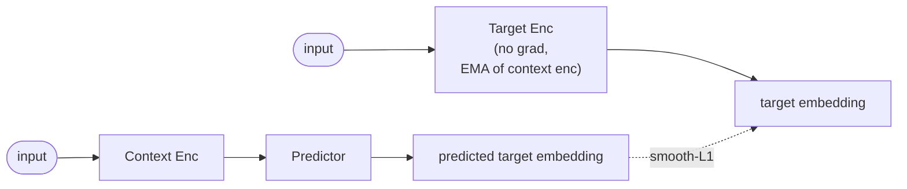
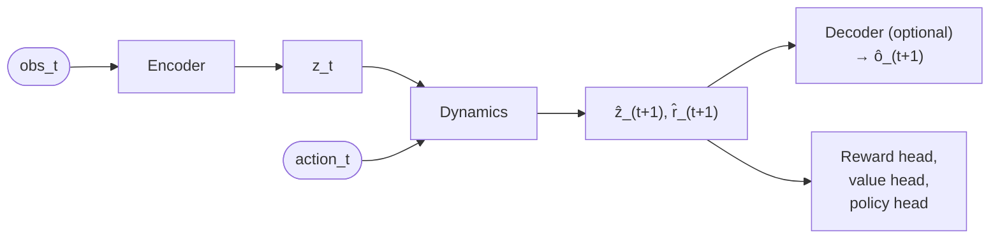
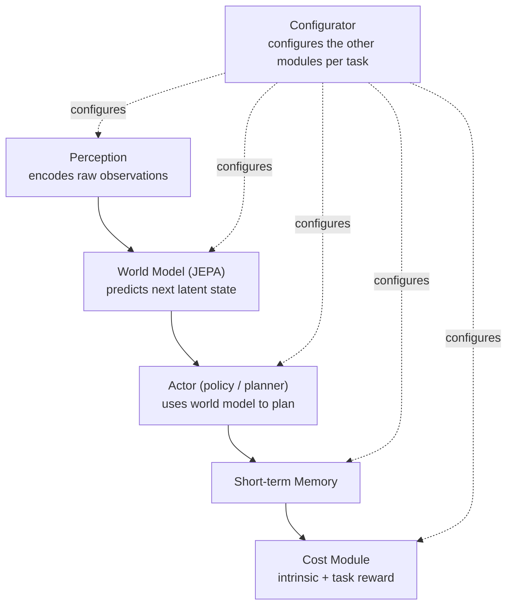

# World Models & JEPA

## Why This Exists

**Problem**: Most self-supervised learning either (a) reconstructs pixels (MAE, autoencoders) — wasting capacity on irrelevant detail like exact RGB values, or (b) needs hand-crafted negative pairs / augmentation pipelines (SimCLR, MoCo, DINO). Reinforcement-learning agents have a parallel problem: they either learn from scratch with billions of environment steps, or they imagine future frames pixel-by-pixel, which is slow and noisy.

**Key insight**: Predict in **representation space**, not pixel/token space. The model learns to forecast what an encoder would output for the masked / future / target part of the input — so it can ignore noise and focus on structure. JEPA is the self-supervised flavour; classical world models (Dreamer, MuZero) are the RL flavour. Both share the same trick: a learned latent that is easier to predict than raw observations.

**Reach for this when**: You want a strong visual backbone without contrastive negatives or augmentations (I-JEPA), a video pretraining objective that captures motion (V-JEPA), or an agent that plans by rolling out a learned latent dynamics model (Dreamer, MuZero, TD-MPC2, DIAMOND).

---

## Two Families, One Idea

| Family | Goal | Predict in | Examples |
|--------|------|-----------|----------|
| **JEPA — self-supervised** | Learn transferable representations | Embedding of masked patches / future frames | I-JEPA, V-JEPA, V-JEPA 2, A-JEPA |
| **World models — RL** | Plan / imagine inside a learned simulator | Latent state of next observation + reward | Dreamer V1-V3, MuZero, TD-MPC2, DIAMOND, Genie, GameNGen, Ha & Schmidhuber |

Both train an encoder + dynamics/predictor pair. JEPA stops there (downstream tasks use the encoder); world models add a policy / planner that acts inside the imagined rollout.

---

# Part 1 — JEPA (Joint Embedding Predictive Architecture)

## The Three Components



1. **Context encoder** — encodes the visible / unmasked part. Trained by gradient descent.
2. **Target encoder** — encodes the *masked* part (the prediction target). **Not** trained by gradient descent; updated as an **EMA of the context encoder**: `θ_target ← m·θ_target + (1-m)·θ_context`, typical `m ≈ 0.996`.
3. **Predictor** — a small transformer that takes context embeddings + positional info for masked positions, and predicts the embeddings the target encoder would produce there.

Loss: smooth-L1 (or MSE) between predictor output and stop-gradient target embeddings.

## Why It Doesn't Collapse

Naive "predict your own representations" has a trivial solution: both encoders output the same constant vector and loss = 0. JEPA blocks it with three mechanisms working together:

1. **Asymmetric architecture** — only the context encoder + predictor receive gradients; the target encoder is updated by EMA, never by the loss.
2. **EMA target** — the target moves slowly, so the context encoder is always chasing a slightly stale target. A constant collapse would have to propagate through EMA before it could be exploited.
3. **Spatial/temporal masking** — predicting embeddings for *specific* masked positions (with positional encodings) forces the predictor to actually use structure; a constant solution can't satisfy position-conditioned targets.

This is the same trick as BYOL and DINO, but JEPA additionally drops the augmentation pipeline — masking does the augmentation work.

## I-JEPA, V-JEPA, V-JEPA 2, A-JEPA

| Variant | Modality | Masking | Notable |
|---------|----------|---------|---------|
| **I-JEPA** (Assran et al., CVPR 2023) | Images | Mask 4 large blocks (~15-20% of image each); context is a separate large block | First JEPA; competitive with MAE / DINO **without augmentations** |
| **V-JEPA** (Bardes et al., 2024) | Video | Mask spacetime tubes (consistent across time) | Learns motion; strong on Kinetics-400, Something-Something v2 |
| **V-JEPA 2** (Assran et al., 2025) | Video → action | Pretrained on ~1M h video; small action-conditioned predictor head fine-tuned on robot data | Action-conditioned latent rollouts → zero-shot robot planning. The bridge from JEPA to world models |
| **A-JEPA** (Fei et al., 2023) | Audio spectrograms | Curriculum mask of time-frequency patches | Same recipe on log-mel spectrograms |

V-JEPA 2 is the inflection point: JEPA-style pretraining + a small action-conditioned predictor head → robot manipulation by planning in latent space. That's a JEPA encoder being used *as* a world model.

## Reference Implementation (Ray Train + DDP, runs on CIFAR-10)

This is the minimal but real-world pattern: patch embed → encoder → predictor with EMA target. Multi-GPU via Ray Train, ends with linear-probe evaluation. Distilled from a working SoundTroopers training script.

```python
"""I-JEPA on CIFAR-10 — Ray Train TorchTrainer + linear probe."""
import copy
import torch, torch.nn as nn, torch.nn.functional as F
import torchvision, torchvision.transforms as T
import ray.train
from ray.train import ScalingConfig
from ray.train.torch import TorchTrainer

IMG, PATCH, DIM = 64, 8, 256
N = (IMG // PATCH) ** 2  # 64 patches

class PatchEmbed(nn.Module):
    def __init__(self):
        super().__init__()
        self.proj = nn.Conv2d(3, DIM, PATCH, stride=PATCH)
    def forward(self, x):
        return self.proj(x).flatten(2).transpose(1, 2)  # (B, N, DIM)

class Encoder(nn.Module):
    def __init__(self, depth=6):
        super().__init__()
        self.patch_embed = PatchEmbed()
        self.pos_embed = nn.Parameter(torch.randn(1, N, DIM) * 0.02)
        layer = nn.TransformerEncoderLayer(DIM, 4, DIM * 4, batch_first=True, dropout=0.1)
        self.blocks = nn.TransformerEncoder(layer, depth)
        self.norm = nn.LayerNorm(DIM)
    def forward(self, x, mask_idx=None):
        h = self.patch_embed(x) + self.pos_embed
        if mask_idx is not None:
            h = torch.gather(h, 1, mask_idx.unsqueeze(-1).expand(-1, -1, DIM))
        return self.norm(self.blocks(h))

class Predictor(nn.Module):
    def __init__(self, pred_dim=128, depth=3):
        super().__init__()
        self.proj_in = nn.Linear(DIM, pred_dim)
        self.pos_embed = nn.Parameter(torch.randn(1, N, pred_dim) * 0.02)
        self.mask_token = nn.Parameter(torch.randn(1, 1, pred_dim) * 0.02)
        layer = nn.TransformerEncoderLayer(pred_dim, 4, pred_dim * 4, batch_first=True, dropout=0.1)
        self.blocks = nn.TransformerEncoder(layer, depth)
        self.proj_out = nn.Linear(pred_dim, DIM)
    def forward(self, ctx_emb, ctx_idx, tgt_idx):
        B, Kt, Pd = ctx_emb.size(0), tgt_idx.size(1), self.proj_in.out_features
        ctx = self.proj_in(ctx_emb) + torch.gather(
            self.pos_embed.expand(B, -1, -1), 1, ctx_idx.unsqueeze(-1).expand(-1, -1, Pd))
        tgt = self.mask_token.expand(B, Kt, -1) + torch.gather(
            self.pos_embed.expand(B, -1, -1), 1, tgt_idx.unsqueeze(-1).expand(-1, -1, Pd))
        out = self.blocks(torch.cat([ctx, tgt], dim=1))
        return self.proj_out(out[:, ctx_emb.size(1):])  # (B, Kt, DIM)

def sample_masks(B):
    """Random non-overlapping context (50% of patches) + target (25% of patches).
    Production I-JEPA uses spatial *blocks* — see implementation notes below."""
    ctx, tgt = [], []
    for _ in range(B):
        perm = torch.randperm(N)
        ctx.append(perm[:N // 2].sort().values)
        tgt.append(perm[N // 2 : N // 2 + N // 4].sort().values)
    return torch.stack(ctx), torch.stack(tgt)

@torch.no_grad()
def ema_update(online, target, m=0.996):
    src = online.module.parameters() if hasattr(online, "module") else online.parameters()
    for po, pt in zip(src, target.parameters()):
        pt.data.mul_(m).add_((1 - m) * po.data)

def train_loop(config):
    rank = ray.train.get_context().get_world_rank()
    world_size = ray.train.get_context().get_world_size()

    transform = T.Compose([T.Resize(64), T.ToTensor(), T.Normalize((0.5,) * 3, (0.5,) * 3)])
    train_ds = torchvision.datasets.CIFAR10("/tmp/data", train=True, download=True, transform=transform)
    sampler = torch.utils.data.DistributedSampler(train_ds, world_size, rank, shuffle=True)
    loader = torch.utils.data.DataLoader(train_ds, batch_size=config["batch_size"],
                                         sampler=sampler, num_workers=4, drop_last=True, pin_memory=True)

    encoder = Encoder()
    target_encoder = copy.deepcopy(encoder)
    predictor = Predictor()
    for p in target_encoder.parameters():
        p.requires_grad = False

    encoder = ray.train.torch.prepare_model(encoder)
    predictor = ray.train.torch.prepare_model(predictor)
    device = ray.train.torch.get_device()
    target_encoder = target_encoder.to(device)   # NOT prepare_model — never trained by DDP

    opt = torch.optim.AdamW(
        list(encoder.parameters()) + list(predictor.parameters()),
        lr=config["lr"], weight_decay=0.05)

    for epoch in range(config["epochs"]):
        sampler.set_epoch(epoch)
        total, steps = 0.0, 0
        for imgs, _ in loader:
            imgs = imgs.to(device)
            B = imgs.size(0)
            ctx_idx, tgt_idx = sample_masks(B)
            ctx_idx, tgt_idx = ctx_idx.to(device), tgt_idx.to(device)

            with torch.no_grad():
                h = target_encoder(imgs)                          # full image
                h = F.layer_norm(h, (h.size(-1),))                # normalize per-patch — important
                h = torch.gather(h, 1, tgt_idx.unsqueeze(-1).expand(-1, -1, DIM))

            z = encoder(imgs, ctx_idx)                            # context only
            z = predictor(z, ctx_idx, tgt_idx)                    # predict target embeddings
            loss = F.smooth_l1_loss(z, h)

            opt.zero_grad(); loss.backward(); opt.step()
            ema_update(encoder, target_encoder)
            total += loss.item(); steps += 1

        ray.train.report({"loss": total / steps, "epoch": epoch + 1})

# Launch with: TorchTrainer(train_loop, train_loop_config={...},
#   scaling_config=ScalingConfig(num_workers=10, use_gpu=True))
```

**Implementation notes — the parts that bite**:

- **Layer-norm the target** before the loss (`F.layer_norm(h, (h.size(-1),))`). Without it, training drifts toward collapse.
- **Stop-gradient on the target path** is enforced by `torch.no_grad()` *and* `requires_grad=False` on every target-encoder parameter. Both must be set.
- **EMA momentum 0.996 → 0.9999.** Most public code linearly ramps the momentum up over training; lower momentum is faster but unstable.
- **Mask geometry > mask ratio.** I-JEPA uses 4 large *spatial blocks* (~15-20% each) as targets and a separate large block as context. The simple random-permutation `sample_masks` above is a teaching version — replace with block sampling for full performance.
- **Don't DDP-wrap the target encoder.** It's not learning. Move it to device manually and skip `prepare_model`.
- **Predictor << encoder.** I-JEPA paper: ViT-B encoder + a 6-layer narrower predictor. The predictor is meant to be a small "extrapolator", not a second encoder.

## Evaluation: Linear Probe

Standard SSL eval: freeze the encoder, train a linear classifier on its features.

```python
enc = encoder.module
enc.eval()
probe = nn.Linear(DIM, 10).to(device)
probe_opt = torch.optim.Adam(probe.parameters(), lr=1e-3)
for ep in range(10):
    for imgs, labels in train_probe_loader:
        with torch.no_grad():
            features = enc(imgs.to(device)).mean(dim=1)  # mean-pool patch tokens
        loss = F.cross_entropy(probe(features), labels.to(device))
        probe_opt.zero_grad(); loss.backward(); probe_opt.step()
# CIFAR-10 at 64x64: random=10%, well-trained I-JEPA ≈ 60-75%, supervised ≈ 95%.
```

## Loading Official Pretrained JEPAs

```python
# I-JEPA — official Meta checkpoints in the facebookresearch/ijepa repo
# V-JEPA / V-JEPA 2 — facebookresearch/jepa and facebookresearch/vjepa2

# Quick HuggingFace path for V-JEPA features
from transformers import AutoVideoProcessor, AutoModel
processor = AutoVideoProcessor.from_pretrained("facebook/vjepa2-vitl-fpc16-256-ssv2")
model = AutoModel.from_pretrained("facebook/vjepa2-vitl-fpc16-256-ssv2")
# inputs = processor(video_frames, return_tensors="pt"); features = model(**inputs).last_hidden_state
```

## JEPA vs Other SSL

| Method | Predicts | Augmentations | Negatives | Notes |
|--------|----------|--------------|-----------|-------|
| **I-JEPA** | Embeddings of masked blocks | None | None | EMA target prevents collapse |
| **MAE** | Raw pixels of masked patches | Light | None | Wastes capacity on pixels |
| **DINO / DINOv2** | Soft assignments to centroids | Heavy multi-crop | None | EMA + centering against collapse |
| **SimCLR / MoCo** | Match positive against negatives | Heavy | Many | Augmentation-sensitive |
| **BYOL** | Representations of an augmented view | Heavy | None | EMA, similar trick — but needs aug |

Decision: pick **I-JEPA** when you want strong features without an augmentation pipeline (medical imaging, satellite, novel modalities). Pick **DINOv2** when you have time to tune augs and want the absolute best-known visual encoder. Pick **MAE** when you specifically need a generative reconstruction objective.

---

# Part 2 — World Models for RL & Planning

A "world model" learns environment dynamics so an agent can plan or train in imagination instead of (only) the real environment.

## The Recurring Architecture



Variants differ on what the latent is, whether there's a decoder, and how the policy is trained.

## Family Map

| Model | Latent | Decoder? | How agent uses it |
|-------|--------|----------|-------------------|
| **World Models** (Ha & Schmidhuber, 2018) | VAE z + MDN-RNN | Yes (VAE) | Train CMA-ES policy in dream |
| **Dreamer V1/V2/V3** (Hafner et al.) | RSSM stochastic + deterministic state | Yes (image recon) | Actor-critic trained on imagined rollouts |
| **MuZero** (Schrittwieser et al., 2019) | Learned abstract state | **No** | MCTS planning over learned dynamics; predicts reward/value/policy only |
| **TD-MPC / TD-MPC2** (Hansen et al.) | Latent state | No | MPC with MPPI sampling + value bootstrap |
| **DIAMOND** (Alonso et al., 2024) | Diffusion model over pixels | Implicit | Train standard RL agent inside a diffusion-generated environment |
| **Genie** (Bruce et al., 2024) | Latent action codes + ST-Transformer | Yes | Generate playable 2D worlds from a single image prompt |
| **GameNGen** (Valevski et al., 2024) | Diffusion conditioned on action history | Pixel | Real-time playable DOOM via SD fine-tuning |
| **V-JEPA 2** (Meta, 2025) | JEPA video embedding + action-conditioned predictor | No | Latent rollout for robot planning — JEPA-as-world-model |

## Two Design Axes

**Latent vs pixel dynamics.** Predicting in latent space (Dreamer, MuZero, TD-MPC, V-JEPA 2) is faster and ignores irrelevant detail; predicting in pixel space (DIAMOND, GameNGen) keeps the model honest about what an agent / human would see — important for visually-grounded games and demos.

**With or without a decoder.** Dreamer reconstructs observations because the auxiliary recon loss helps the encoder. MuZero and TD-MPC drop the decoder entirely — the latent only needs to be useful for predicting reward and value, not for reconstruction. JEPA + V-JEPA 2 sit in this no-decoder camp on the SSL side.

## Decision Table

| Problem | Pick | Why |
|---------|------|-----|
| Continuous control (locomotion, manipulation) | **Dreamer V3** or **TD-MPC2** | Best sample efficiency in continuous domains |
| Discrete action games (Atari, board games) | **Dreamer V3** (general) or **MuZero** (planning-heavy) | DV3 ≥ human on Atari without per-game tuning |
| Visually-rich game / interactive video demo | **DIAMOND**, **GameNGen** | Pixel-level fidelity matters for playability |
| Generate a whole new playable world from a prompt | **Genie** | Designed for prompt → playable env |
| Robot manipulation from raw video pretraining | **V-JEPA 2** | Pretrained on ~1M h video, action-conditioned head added |
| Pure SSL pretraining for a downstream encoder | **I-JEPA / V-JEPA / DINOv2** | No policy or planner needed |
| Want a small, hackable baseline | **Ha & Schmidhuber 2018** or **DreamerV2** | Full reference implementations, well-understood |

## Where LeCun Places JEPA

LeCun's "Path Towards Autonomous Machine Intelligence" (2022) puts JEPA as the **world model module** in a multi-component cognitive architecture:



Argument: today's LLMs are System-1 (fast, reactive, no internal simulator). JEPA-based world models enable System-2 — explicit forward simulation in a learned latent space. **V-JEPA 2 is the first concrete instantiation of this stack at scale**: a JEPA-pretrained video encoder with an action-conditioned predictor head used for zero-shot robot planning.

---

## Common Pitfalls

| Pitfall | Symptom | Fix |
|---------|---------|-----|
| Loss → 0 instantly, features useless | Representation collapse | Verify EMA momentum (≥0.996), check stop-grad on target encoder, layer-norm the target embeddings before loss |
| Training spikes / NaN | EMA momentum too low or LR too high | Raise momentum to 0.999, use warmup, smooth-L1 instead of MSE |
| Linear probe accuracy stuck near random | Predictor too big and "absorbing" the encoder | Make predictor << encoder (≤ half depth, narrower hidden) |
| Random-mask I-JEPA underperforms MAE | Mask geometry wrong | Use 4 large block targets + separate large context block (per the I-JEPA paper) — not random-per-patch |
| DDP wrap on target encoder | Gradient errors / sync hangs | Don't `prepare_model` the target encoder; move to device manually, set `requires_grad=False` |
| World-model agent diverges in imagination | Long rollouts compound error | Shorten horizon (Dreamer uses ~15 steps), add KL balancing, train policy + dynamics with separate losses |

---

## See Also

- [Vision](../vision/) — DINOv2, MAE, ViT — the SSL baselines JEPA competes with.
- [Audio](../audio/) — A-JEPA uses the same patch-on-spectrogram pattern.
- [Reinforcement Learning](../reinforcement-learning/) — Dreamer, MuZero, TD-MPC2 sit at the intersection of world models and RL.
- [Embeddings](../embeddings/) — JEPA produces embeddings; downstream RAG / retrieval / probing patterns live here.
- [Transformer](../transformer/) — encoder + predictor are both transformers; positional-encoding details matter.
- [`ml-training/data-parallel/`](../../ml-training/data-parallel/) and [`ml-libraries/ray/`](../../ml-libraries/ray/) — how to scale the reference implementation across multiple GPUs.

---

## References

### JEPA — Position & Core Papers
- [A Path Towards Autonomous Machine Intelligence (LeCun, 2022)](https://openreview.net/forum?id=BZ5a1r-kVsf) — position paper that introduced the JEPA idea
- [I-JEPA — Self-Supervised Learning from Images with a Joint-Embedding Predictive Architecture (Assran et al., CVPR 2023)](https://arxiv.org/abs/2301.08243), [official repo](https://github.com/facebookresearch/ijepa)
- [V-JEPA — Revisiting Feature Prediction for Learning Visual Representations from Video (Bardes et al., 2024)](https://arxiv.org/abs/2404.08471), [official repo](https://github.com/facebookresearch/jepa), [Meta blog](https://ai.meta.com/blog/v-jepa-yann-lecun-ai-model-video-joint-embedding-predictive-architecture/)
- [V-JEPA 2 — Self-Supervised Video Models Enable Understanding, Prediction and Planning (Assran et al., 2025)](https://arxiv.org/abs/2506.09985), [official repo](https://github.com/facebookresearch/vjepa2), [Meta blog](https://ai.meta.com/blog/v-jepa-2-world-model-benchmarks/)
- [A-JEPA — Joint-Embedding Predictive Architecture Can Listen (Fei et al., 2023)](https://arxiv.org/abs/2311.15830)
- [JEPA & Intuitive Physics (facebookresearch/jepa-intuitive-physics)](https://github.com/facebookresearch/jepa-intuitive-physics) — JEPA evaluated on intuitive-physics benchmarks

### Related SSL Backbones
- [DINOv2 — Learning Robust Visual Features without Supervision (Oquab et al., 2023)](https://arxiv.org/abs/2304.07193) — main non-JEPA point of comparison

### World Models — Classics & Modern
- [World Models (Ha & Schmidhuber, 2018)](https://arxiv.org/abs/1803.10122) — canonical VAE + MDN-RNN dream-policy paper
- [Dream to Control / Dreamer V1 (Hafner et al., 2019)](https://arxiv.org/abs/1912.01603)
- [DreamerV2 — Mastering Atari with Discrete World Models (Hafner et al., 2020)](https://arxiv.org/abs/2010.02193)
- [DreamerV3 — Mastering Diverse Domains through World Models (Hafner et al., 2023)](https://arxiv.org/abs/2301.04104), [reference repo](https://github.com/danijar/dreamerv3), [project page](https://danijar.com/project/dreamerv3/)
- [MuZero — Mastering Atari, Go, Chess and Shogi by Planning with a Learned Model (Schrittwieser et al., 2019)](https://arxiv.org/abs/1911.08265)
- [TD-MPC2 — Scalable, Robust World Models for Continuous Control (Hansen et al., 2023)](https://arxiv.org/abs/2310.16828), [project page](https://www.tdmpc2.com/)
- [DIAMOND — Diffusion for World Modeling: Visual Details Matter in Atari (Alonso et al., 2024)](https://arxiv.org/abs/2405.12399), [official repo](https://github.com/eloialonso/diamond), [project page](https://diamond-wm.github.io/)
- [Genie — Generative Interactive Environments (Bruce et al., 2024)](https://arxiv.org/abs/2402.15391), [project page](https://sites.google.com/view/genie-2024/)
- [GameNGen — Diffusion Models Are Real-Time Game Engines (Valevski et al., 2024)](https://arxiv.org/abs/2408.14837), [project page](https://gamengen.github.io/)
